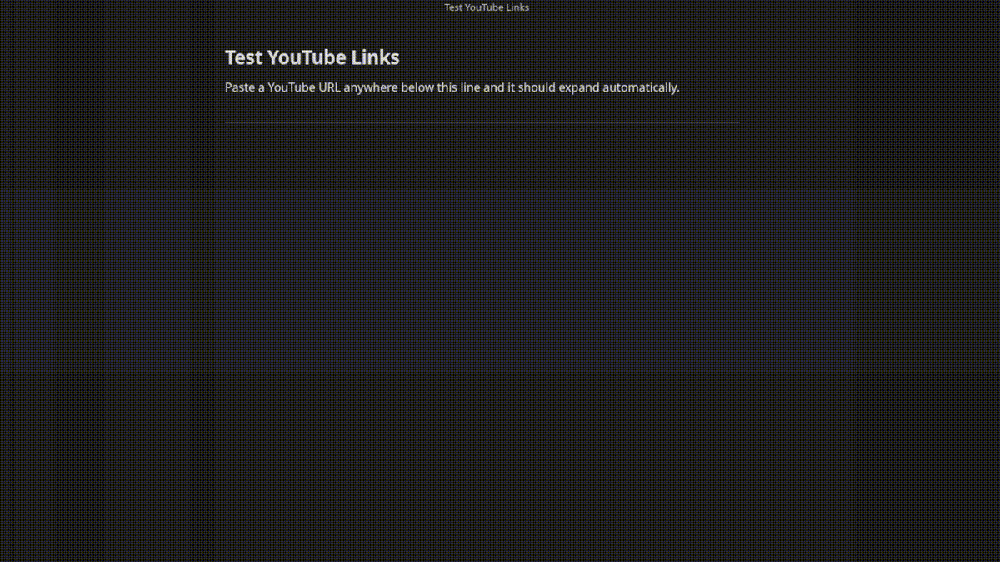

# YouTube Links

[](https://github.com/xevrion/obsidian-youtube-links/releases/latest)
[](https://github.com/xevrion/obsidian-youtube-links/releases)
[](https://ko-fi.com/xevrion)
[](https://github.com/sponsors/xevrion)

Paste a YouTube URL into any note and it instantly becomes a clean, readable link showing the channel name and video title, just like Notion does it.



```
Before: https://www.youtube.com/watch?v=dQw4w9WgXcQ
After:  [Rick Astley: Never Gonna Give You Up](https://www.youtube.com/watch?v=dQw4w9WgXcQ)
```

No API key needed. Works with regular links, short links, and Shorts.

## Supported URL formats

- `https://www.youtube.com/watch?v=...`
- `https://youtu.be/...`
- `https://www.youtube.com/shorts/...`

## Settings

Open Settings > YouTube Links to configure:

- **Link format** - show `Channel: Video Title` or just the video title
- **Show loading text** - show `Loading...` as a placeholder while the title is being fetched

## Installation

Search for **YouTube Links** in Settings > Community plugins > Browse.

### Manual

1. Download `main.js` and `manifest.json` from the [latest release](https://github.com/xevrion/obsidian-youtube-links/releases/latest)
2. Create a folder `.obsidian/plugins/youtube-links/` in your vault
3. Copy both files into that folder
4. Enable the plugin in Settings > Community plugins

## Support

If this plugin saves you time, consider buying me a coffee or sponsoring on GitHub.

[](https://ko-fi.com/xevrion)
